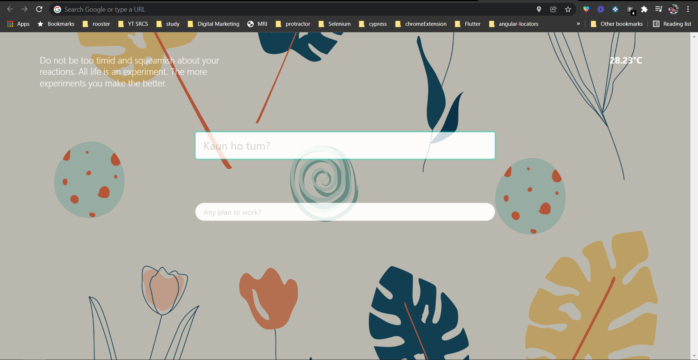
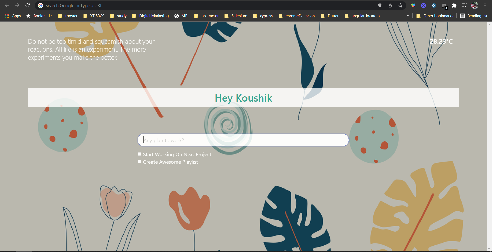

# Gravity
A chrome extension that is similar to Momentum

## How to use?
- Clone the project
- Goto chrome://extensions/ in chrome browser
- Enable developer mode
- Click on Load unpacked
- Navigate & select the folder
- Open new tab to enjoy the extension

## Tutorial
- [Youtube Playlist](https://youtube.com/playlist?list=PL699Xf-_ilW4_ADvj10QZ4B4dZf0Acly2)

## Features
- Dynamic background (thanks to Pixabay API)
- Daily random quotes
- Weather based on user location
- A complete todo application

## Screenshot

